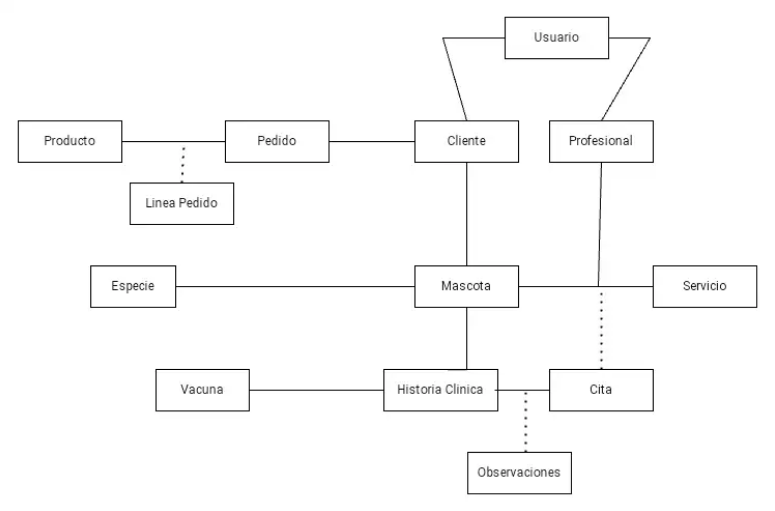

# Propuesta TP DSW

## Grupo
### Integrantes
* legajo - Apellido(s), Nombre(s)
* 51358 - Colman, Geronimo
* 51794 - Degiusti, Florencia
* 50552 - Delgado, David
* 50364 - Larroquette, Juan Bautista
* 50361 - Munné, Facundo

### Repositorios
* [frontend app](http://hyperlinkToGihubOrGitlab)
* [backend app](http://hyperlinkToGihubOrGitlab)

## Tema
### Descripción
El sistema consiste en una aplicación web para gestionar de manera eficiente las operaciones de una clínica veterinaria. Permite la administración de clientes, profesionales, mascotas y turnos, todo a través de una interfaz fácil de usar. Los administradores (recepcionistas) pueden gestionar turnos, clientes y profesionales, mientras que los profesionales pueden consultar y actualizar sus turnos, además de registrar observaciones sobre las mascotas. Con un enfoque en la organización y el flujo de trabajo eficiente, el sistema busca mejorar la atención al cliente y optimizar las tareas administrativas dentro de la clínica.

### Modelo

## Alcance Funcional 

### Alcance Mínimo

|Req|Detalle|
|:-|:-|
|CRUD simple|1. CRUD Cliente 2. CRUD Profesional 3. CRUD Servicio 4. CRUD Vacuna 5. Producto 6. Tipo|
|CRUD dependiente|1. CRUD Mascota {depende de} CRUD Cliente 2. CRUD Historia Clinica {depende de} CRUD Mascota |
|Listado + detalle| 1. Listado de clientes filtrado por nombre de cliente, apellido y DNI, muestra nombre, apellido, DNI, teléfono, mail, dirección, fecha de nacimiento => detalle CRUD Cliente  2. Listado de servicios filtrado por nombre del servicio, muestra nombre del servicio, descripción y precio => detalle CRUD Servicio 3. Listado de servicios filtrado por nombre del servicio, muestra nombre del servicio, descripción,precio y acciones => detalle CRUD Servicio|
|CUU/Epic|1. Solicitar turno para mascota 2. Registrar Observacion despues de consulta 3. Realizar un pedido en la tienda|

